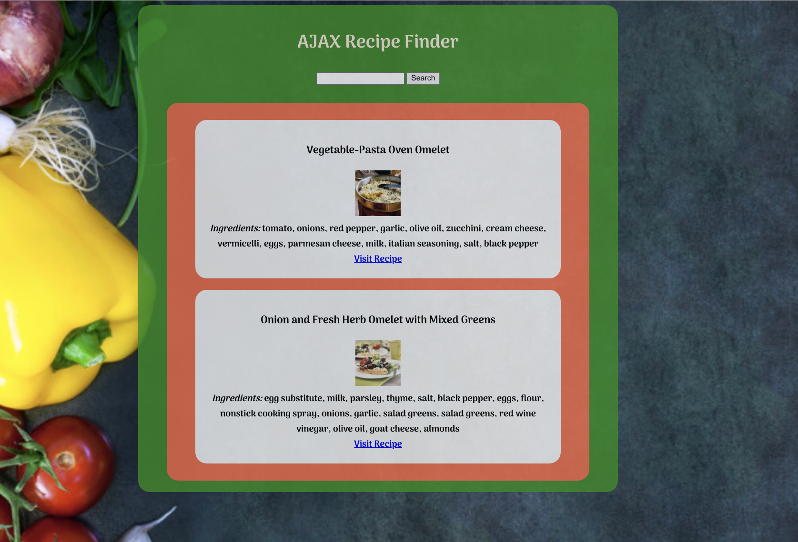
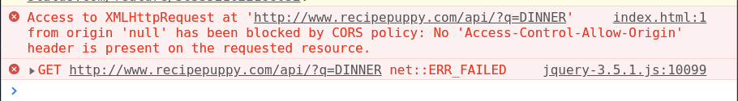

# AJAX Recipe Finder

**In this exercise you will be writing the neccessary code to allow users to search for a recipe from this Web API [Recipe Puppy](http://www.recipepuppy.com/about/api/)**



### Prerequisites

 - Able to write and walk through executing Asynchronous Code

 - Able to Manipulate and handle events on the DOM

 - Familiarilty with basic jQuery

 - Basic understanding of AJAX, and using $.get()

*If you need to, review - [Lesson: Asynchronous Code Execution & AJAX](https://docs.google.com/presentation/d/1jTFwPXmyZis1Ab7qKXrTlDC4gsXLB7TG3ZUjlwDPvQI/present)*

### Objectives

By the end of this exercise, you should be able to:

 - Use $.get (a.k.a make an AJAX call) to get data from an external URL and pass that data along to another function. 

 - Be able to modify the DOM API with results from and AJAX call

 - Be able to take information from a user interaction and pass that information in to an AJAX call.


### Getting Started

- Fork, then clone down this repo

- Open the `index.html` page in your browser,  make sure you have your browser console open.

- Read the comments and use it to formulate your plan to complete the exercise


### Resources

 - [$.get](https://api.jquery.com/jQuery.get/)

 - [Template Literals for String Substitution](https://developers.google.com/web/updates/2015/01/ES6-Template-Strings)

 - [Recipe Puppy API](http://www.recipepuppy.com/about/api/)

 - [Selecting Elements with jQuery](https://api.jquery.com/jQuery/#jQuery1)

 - [Creating New Elements with jQuery](https://api.jquery.com/jQuery/#jQuery2)

 - [Adding Click Events with jQuery](https://api.jquery.com/click/)

 - [$.append](https://api.jquery.com/append/)

------------------------------------------------------------------------------
------------------------------------------------------------------------------
*side notes:*


### What is that cors-anywhere for?

 - The Web API you are using does not say it allows CORS. So you'll be using [cors anywhere](https://cors-anywhere.herokuapp.com/) to bypass it.
 What's happening is that the API sends your web browser the data, but your web browser does not see something that says it can use the data in your webpage, so it blocks you from using it.
 
~[Learn more about CORS](https://en.wikipedia.org/wiki/Cross-origin_resource_sharing)

 Here's what happens if you didn't use [cors anywhere](https://cors-anywhere.herokuapp.com/):




To fix this problem, we add "https://cors-anywhere.herokuapp.com/" to our AJAX request like this:
(notice the url string)
```javascript
$.get('https://cors-anywhere.herokuapp.com/http://www.recipepuppy.com/api/?q=DINNER', (data) => {
    var results = JSON.parse(data) // The data comes to us in JSON format, it must be parsed in to a object that we can use
    console.log(results);
})
```
CORS anywhere will add the appropriate CORS policy headers we need to the response from "http://www.recipepuppy.com/api/?q=DINNER" and send it back to us. Your web browser sees it, and everything works.


### Font

- The font used in this app is from [google fonts](https://fonts.google.com/)